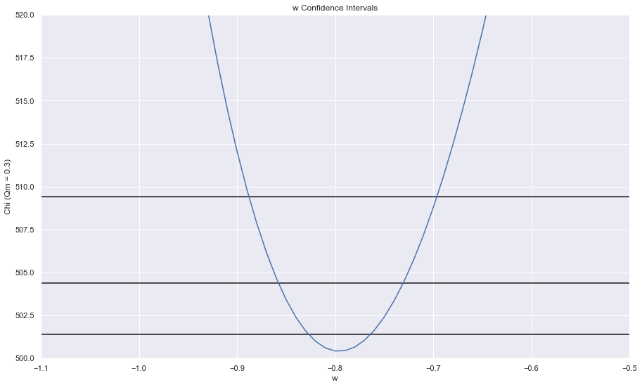

# darkmatter

## Summary
Calculate the equation of state of the universe using Type Ia supernova data. [Read More](https://brandontouchet.com/blog/posts/2011-05-20-DarkMatter/)

Below is a plot of $\Chi^2$ vs. $w$, the equation-of-state (EOS), with three confidence intervals. With $95%$ confidence we estimate EOS, $-0.885<w<-0.7$.

## Resources

* [Advisor's paper](https://arxiv.org/pdf/astro-ph/0112526.pdf)
* [Data Source - Table 11](https://arxiv.org/pdf/0804.4142.pdf)

